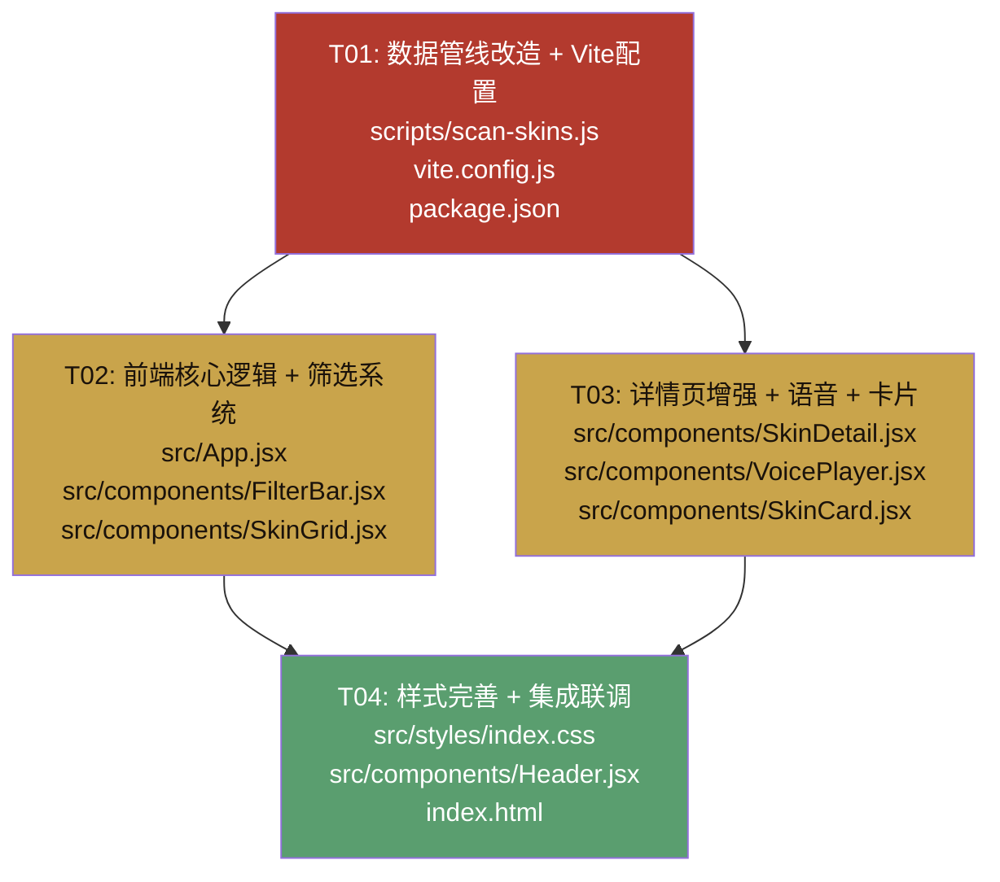

# 三国杀皮肤画廊优化 — 系统设计文档

> 架构师：高见远 (Bob)  
> 项目路径：`E:\BaiduSyncdisk\工作\my_git\sgs-skin-gallery`  
> 日期：2026-07-06

---

## Part A: 系统设计

### 1. 实现方案与框架选型

#### 1.1 技术栈确认

**不变更技术栈**。现有技术栈完全满足需求：

| 层面 | 现有方案 | 是否变更 | 说明 |
|------|---------|---------|------|
| 构建工具 | Vite 5 | 否 | 自定义中间件已支持 /skins/ 代理，扩展 /voice/ 即可 |
| UI 框架 | React 18 | 否 | 函数组件 + Hooks 模式 |
| 样式 | Tailwind CSS (CDN) + 原生 CSS | 否 | 新增少量 CSS 类 |
| 数据格式 | 静态 JSON | 否 | scan-skins.js 预处理生成 |
| 无新增 npm 依赖 | — | — | 所有需求均可通过现有依赖实现 |

#### 1.2 核心技术挑战与方案

**挑战1：多数据源合并**  
scan-skins.js 当前仅读取 metadata.json。需额外加载 characters.json（武将技能/称号）和 pack_character_map.json（卡包归属），三个数据源以武将名为关联键合并。

- **方案**：在 scan-skins.js 中新增 `loadCharacters()` 和 `loadPackCharacterMap()` 函数，构建两个内存查找表（`charMap`、`packMap`），在遍历 generals 时逐一关联。匹配失败的武将归入"其他"分类（Q1 决策）。

**挑战2：audio 字段解析为可播放的 voices 数组**  
metadata.json 的 `audio` 字段结构为 `{ "技能名": ["url1", "url2"] }`，需转换为 VoicePlayer 期望的 `voices[]` 格式。

- **方案**：新增 `convertAudioToVoices(audio)` 函数，遍历 audio 对象的每个 key-value，生成 `{ skill, type, label, files }` 对象。`type` 字段：key 为"阵亡"时设为 `'dead'`，其余设为 `'skill'`。

**挑战3：外部音频 URL 的 CORS 问题**  
audio URL 指向 `https://web.sanguosha.com/...`，可能存在 CORS 限制。

- **方案**（Q3 决策）：先测试直连（`new Audio(url)` 直接使用外部 URL）。同时在 vite.config.js 预置 `/voice/` 代理路由作为后备——若直连失败，VoiceClip 中将 URL 改为 `/voice/${encodeURIComponent(url)}` 即可走代理。

**挑战4：卡包筛选 UI 的层级展开**  
10 大分类 × 88+ 卡包，需可展开/折叠的二级筛选器。

- **方案**：FilterBar 中新增"卡包"筛选行。一级为分类按钮（10 个），点击展开/折叠该分类下的卡包列表。选中卡包后与势力/品质/性别/搜索/收藏册筛选叠加。

**挑战5：收藏册筛选的 77 种选项**  
收藏册数量多，不适合平铺按钮，使用下拉选择器。

- **方案**：FilterBar 新增"收藏册"行，使用原生 `<select>` 下拉，选项从 skin-data.json 动态提取去重。

#### 1.3 架构模式

保持现有 **组件化 + 单向数据流** 模式：
- App.jsx 为唯一状态容器，所有 filter state 集中管理
- FilterBar 为纯展示组件（受控），通过 props 回调通知 App
- SkinGrid / SkinDetail 为纯展示组件，接收数据 + 回调
- 数据预处理（scan-skins.js）与前端运行时完全解耦

---

### 2. 文件列表及相对路径

| 文件路径 | 操作 | 说明 |
|---------|------|------|
| `scripts/scan-skins.js` | [修改] | 新增多数据源加载、合并逻辑，生成 pack-data.json |
| `vite.config.js` | [修改] | 新增 `/voice/` 代理路由（CORS 后备方案） |
| `public/skin-data.json` | [修改-自动生成] | 扩展 general/skin 字段（由 scan-skins.js 重新生成） |
| `public/pack-data.json` | [新建-自动生成] | 卡包分类数据（由 scan-skins.js 生成） |
| `src/App.jsx` | [修改] | 新增 pack/collection 筛选 state、加载 pack-data.json、扩展 filteredGenerals |
| `src/components/FilterBar.jsx` | [修改] | 新增卡包筛选行 + 收藏册下拉 |
| `src/components/SkinGrid.jsx` | [修改] | 适配 collection 筛选、新增 pack 显示 |
| `src/components/SkinCard.jsx` | [修改] | 新增卡包标签显示 |
| `src/components/SkinDetail.jsx` | [修改] | 新增技能展示区块、画师/称号/上线时间/获取方式 |
| `src/components/VoicePlayer.jsx` | [修改] | 适配外部 URL 音频播放 |
| `src/styles/index.css` | [修改] | 新增卡包筛选器、技能展示等样式 |
| `src/components/Header.jsx` | [修改] | 微调：结果计数展示适配 |
| `index.html` | [修改] | Tailwind config 无需变更（颜色已有），仅微调标题 |

---

### 3. 数据结构和接口

#### 3.1 扩展后的 General 对象

```jsonc
{
  "id": "柏灵筠",
  "name": "柏灵筠",
  "faction": "魏",
  // —— 以下为新增字段 ——
  "pack": "荟萃-千里单骑",        // 主卡包名 (来自 pack_character_map.json 或 characters.json)
  "packCategory": "荟萃",          // 卡包分类 (从 pack 提取或匹配失败时为 "其他")
  "title": "汉寿亭侯",             // 武将称号 [P1] (来自 characters.json)
  "position": "攻击控制",          // 武将定位 [P1] (来自 characters.json)
  "hallOfFame": "不在内",          // 名将堂 [P1] (来自 characters.json)
  "gender": "男",                  // 性别 (来自 characters.json，补充 gender-map.json)
  "skills": [                      // 武将技能 [P0] (来自 characters.json versions.classic.skills)
    { "name": "武圣", "description": "①你可以将一张红色牌当【杀】使用或打出..." }
  ],
  "skins": [ /* ... 见下方 ... */ ]
}
```

#### 3.2 扩展后的 Skin 对象

```jsonc
{
  "id": "在水一方",
  "name": "在水一方",
  "quality": "史诗",
  "story": "...",
  "quotes": { "灵慧": "...", "阵亡": "..." },
  "static": "魏/在水一方-柏灵筠-静态.png",
  "large": null,
  "dynamic": null,
  // —— 以下为新增/修改字段 ——
  "voices": [                      // [P0 修改] 从 metadata.json audio 字段转换
    {
      "skill": "灵慧",
      "type": "skill",             // "skill" | "dead"
      "label": "灵慧",
      "files": [
        "https://web.sanguosha.com/10/pc/res/assets/runtime/voice/skin/.../xxx_01.mp3",
        "https://web.sanguosha.com/10/pc/res/assets/runtime/voice/skin/.../xxx_02.mp3"
      ]
    },
    {
      "skill": "阵亡",
      "type": "dead",
      "label": "阵亡",
      "files": ["https://web.sanguosha.com/.../Dead.mp3"]
    }
  ],
  "collection": "六出祁山",        // [P1] 所属收藏册 (来自 metadata.json "所属收藏册")
  "artist": "觉觉",                // [P1] 画师 (来自 metadata.json "画师")
  "releaseTime": "2024-8-10",      // [P1] 上线时间 (来自 metadata.json "上线时间")
  "staticAcquisition": "累计参与...", // [P1] 静态获取方式
  "dynamicAcquisition": "累计消费..."  // [P1] 动态获取方式
}
```

#### 3.3 pack-data.json 结构

```jsonc
{
  "generatedAt": "2026-07-06T...",
  "totalCategories": 10,
  "totalPacks": 91,
  "categories": [
    {
      "category": "标准",
      "categoryIcon": "https://patchwiki.biligame.com/...",
      "packs": [
        {
          "name": "标准-贤君明主",
          "icon": "https://patchwiki.biligame.com/...",
          "count": 2,
          "characters": ["刘备", "孙权"]
        }
      ]
    }
    // ... 10 个分类
  ]
}
```

#### 3.4 数据合并逻辑（scan-skins.js）

```
输入数据源:
  1. BWIKI 目录扫描 → generals[] (已有逻辑)
  2. metadata.json → { "皮肤名*武将名": { story, voice_lines, audio, 所属收藏册, 画师, 上线时间, 静态获取方式, 动态获取方式 } }
  3. characters.json → { characters: [{ name, gender, faction, title, position, hall_of_fame, pack, versions.classic.skills[] }] }
  4. pack_character_map.json → { pack_categories: [{ category, packs: [{ name, characters[] }] }] }
  5. general_factions.json → { "武将名": "势力" } (Q4 补充)

合并步骤:
  Step 1: loadBwikiMetadata() → bwikiMeta (已有)
  Step 2: loadCharacters() → charMap: Map<name, { skills, title, position, hallOfFame, gender, pack }>
  Step 3: loadPackCharacterMap() → packMap: Map<character, { pack, category }>
  Step 4: loadGeneralFactions() → factionMap (补充用)
  Step 5: 遍历扫描结果中的每个 general:
    a. charMap.get(general.name) → 合并 skills, title, position, hallOfFame, gender
    b. packMap.get(general.name) → 合并 pack, packCategory
       - 若 packMap 无此武将 → 用 charMap 中的 pack 字段
       - 若仍无 → pack="未知", packCategory="其他"
    c. 遍历 general.skins:
       - lookupSkinMetadata() → 合并 collection, artist, releaseTime, staticAcquisition, dynamicAcquisition
       - convertAudioToVoices(meta.audio) → 覆盖 skin.voices
  Step 6: 输出 skin-data.json (扩展后)
  Step 7: 从 pack_character_map.json 提取 → 输出 pack-data.json
```

#### 3.5 关键函数签名

```javascript
// scan-skins.js 新增函数

/** 加载 characters.json，构建武将查找表 */
function loadCharacters(herosDir) // → Map<string, {skills, title, position, hallOfFame, gender, pack}>

/** 加载 pack_character_map.json，构建武将→卡包查找表 */
function loadPackCharacterMap(herosDir) // → Map<string, {pack, category}>

/** 加载 general_factions.json，构建势力补充表 */
function loadGeneralFactions(skinRoot) // → Map<string, string>

/** 将 metadata.json 的 audio 字段转换为 voices 数组 */
function convertAudioToVoices(audio) // → [{ skill, type, label, files }]

/** 从 pack 名称提取分类名 (取 "-" 前的部分) */
function extractPackCategory(packName) // → string

/** 从 pack_character_map.json 生成 pack-data.json 结构 */
function buildPackData(pcmData) // → { generatedAt, totalCategories, totalPacks, categories }
```

```javascript
// VoicePlayer.jsx 修改

// VoiceClip 组件 — 适配外部 URL
function VoiceClip({ src, label, index }) {
  // src 现在可能是完整的外部 URL (https://web.sanguosha.com/...)
  // 也可能是本地路径 (魏/xxx.png)
  // 判断逻辑: src.startsWith('http') ? src : `/skins/${src}`
  // CORS 后备: src.startsWith('http') ? `/voice/${encodeURIComponent(src)}` : `/skins/${src}`
}
```

#### 3.6 类图

详见 `docs/class-diagram.mermaid`。

---

### 4. 程序调用流程

#### 4.1 数据合并流程（scan-skins.js）

详见 `docs/sequence-diagram.mermaid` 时序图1。

核心流程：`CLI 启动 → 加载4个数据源 → 构建3个查找表 → 遍历扫描结果逐武将合并 → 遍历皮肤合并 metadata → 输出 skin-data.json + pack-data.json`

#### 4.2 前端筛选联动逻辑

详见 `docs/sequence-diagram.mermaid` 时序图2。

核心流程：

```
用户操作 FilterBar → 触发 App.jsx setState → useMemo(filteredGenerals) 重新计算 → SkinGrid 重新渲染

filteredGenerals 筛选链 (7 层叠加):
  1. 势力: g.faction === activeFaction (或 'all')
  2. 卡包分类: g.packCategory === activePackCategory (或 'all')
  3. 卡包: g.pack === activePack (或 'all')
  4. 收藏册: g.skins.some(s => s.collection === activeCollection) (或 'all')
  5. 性别: genderMap[g.id] === targetGender (或 'all')
  6. 品质: g.skins.some(s => s.quality === activeQuality) (或 'all')
  7. 搜索: g.name.includes(query) || g.skins.some(s => s.name.includes(query))

SkinGrid 内部再做 skin 级筛选:
  - 品质: s.quality === activeQuality (当 activeQuality !== 'all')
  - 收藏册: s.collection === activeCollection (当 activeCollection !== 'all')
  - 收藏夹: isFavorite(g.id, s.id) (当 showFavoritesOnly)
```

---

### 5. 待明确事项

| # | 问题 | 当前假设 | 影响 |
|---|------|---------|------|
| 1 | characters.json 中 58 个 skin-data 武将未收录（如"柏灵筠"等新武将），这些武将无技能数据 | skills=[], title/position/hallOfFame=null，packCategory="其他" | P0-2 技能展示对这些武将为空 |
| 2 | metadata.json 的 audio URL 是否可直连（无 CORS） | 先按直连实现，CORS 失败则启用 /voice/ 代理 | P0-3 语音播放 |
| 3 | metadata.json "所属收藏册" 字段有"不在收藏册内"这一特殊值 | 作为普通选项保留下拉列表中 | P1-1 收藏册筛选 |
| 4 | 卡包分类"其他"在 pack_character_map.json 中已有预定义内容 | 保留原数据；扫描中匹配不上的武将也归入"其他" | P0-1 卡包筛选 |
| 5 | characters.json 的 versions 有 classic/breakthrough/national_war 三种 | P0 仅展示 classic 版本技能（Q2 决策） | P0-2 |
| 6 | gender-map.json 与 characters.json 的 gender 字段可能冲突 | 优先使用 characters.json 的 gender（更权威），gender-map.json 作为后备 | 数据合并 |

---

## Part B: 任务分解

### 6. 依赖包列表

**无新增 npm 依赖**。所有功能基于现有技术栈实现：

```
- react@^18.2.0: UI框架 (已有)
- react-dom@^18.2.0: DOM渲染 (已有)
- @vitejs/plugin-react@^4.2.1: React插件 (已有)
- vite@^5.1.0: 构建工具 (已有)
- Tailwind CSS (CDN): 样式框架 (已有，无需安装)
```

---

### 7. 任务列表（按实现顺序）

#### T01: 数据管线改造 + Vite 代理配置

| 项目 | 内容 |
|------|------|
| **任务编号** | T01 |
| **任务名称** | 数据管线改造 + Vite 代理配置 |
| **涉及文件** | `scripts/scan-skins.js` [修改], `vite.config.js` [修改], `package.json` [修改] |
| **依赖** | 无（基础设施任务） |
| **优先级** | P0 |
| **复杂度** | 高 |

**实现要点：**

1. **scan-skins.js 新增数据源加载**：
   - 新增 `HEROS_DIR` 常量：`path.resolve(SKIN_ROOT, '..', 'heros')` 或直接配置为 `E:\BaiduSyncdisk\其他\三国杀皮肤\heros`
   - 新增 `loadCharacters(herosDir)` 函数：读取 characters.json，构建 `charMap`（Map<name, {skills, title, position, hallOfFame, gender, pack}>）
   - 新增 `loadPackCharacterMap(herosDir)` 函数：读取 pack_character_map.json，构建 `packMap`（Map<character, {pack, category}>）
   - 新增 `loadGeneralFactions(skinRoot)` 函数：读取 general_factions.json，构建补充势力表
   - 新增 `convertAudioToVoices(audio)` 函数：遍历 audio 对象，生成 `voices[]` 数组
   - 新增 `buildPackData(pcmData)` 函数：从 pack_character_map.json 生成 pack-data.json 结构

2. **scan-skins.js 修改合并逻辑**：
   - 在 `scanSkins()` 函数中，`loadBwikiMetadata()` 之后调用上述新加载函数
   - 在构建 `allGenerals` 的循环中（约 L269-306），对每个 general：
     - 从 `charMap` 查找并合并 `skills`, `title`, `position`, `hallOfFame`, `gender`
     - 从 `packMap` 查找并合并 `pack`, `packCategory`（匹配失败则 packCategory="其他"）
   - 在构建 `skinList` 的循环中（约 L272-298），对每个 skin：
     - 从 `meta` 提取 `collection`(所属收藏册), `artist`(画师), `releaseTime`(上线时间), `staticAcquisition`(静态获取方式), `dynamicAcquisition`(动态获取方式)
     - 调用 `convertAudioToVoices(meta.audio)` 生成 `voices`，替换当前的空数组
   - 在 `scanSkins()` 末尾，调用 `buildPackData()` 并写入 `public/pack-data.json`

3. **vite.config.js 新增 /voice/ 代理路由**：
   - 在 `skinAssetsPlugin()` 的 `configureServer` 和 `configurePreviewServer` 中间件中，新增 `/voice/` 路径处理
   - 逻辑：解析 `/voice/` 后的 URL（`decodeURIComponent`），使用 Node.js http/https 模块代理请求到外部服务器，流式返回响应
   - 设置 `Content-Type: audio/mpeg` 和 `Access-Control-Allow-Origin: *`

4. **package.json 修改**：
   - 在 scripts 中可新增 `"scan:verbose": "node scripts/scan-skins.js --verbose"`（可选）
   - 无新增 dependencies

5. **验证**：运行 `npm run scan`，检查生成的 `public/skin-data.json` 和 `public/pack-data.json` 字段完整性

---

#### T02: 前端核心逻辑 + 筛选系统

| 项目 | 内容 |
|------|------|
| **任务编号** | T02 |
| **任务名称** | 前端核心逻辑 + 筛选系统（App 状态管理 + FilterBar + SkinGrid） |
| **涉及文件** | `src/App.jsx` [修改], `src/components/FilterBar.jsx` [修改], `src/components/SkinGrid.jsx` [修改] |
| **依赖** | T01（需要扩展后的 skin-data.json 和 pack-data.json） |
| **优先级** | P0 |
| **复杂度** | 高 |

**实现要点：**

1. **App.jsx 修改**：
   - 新增 state：`packData`（PackDataJson）、`activePack`（String, 默认 'all'）、`activePackCategory`（String, 默认 'all'）、`activeCollection`（String, 默认 'all'）
   - 修改 `loadData()`：额外 `fetch('/pack-data.json')`，存入 `packData` state
   - 修改 `filteredGenerals` useMemo：在现有筛选链中插入卡包分类、卡包、收藏册三层筛选
   - 修改 `visibleSkinCount` useMemo：适配收藏册筛选（skin 级别）
   - 修改 FilterBar 组件的 props 传递：新增 `packData`, `activePack`, `activePackCategory`, `activeCollection`, `collections`（从 data 动态提取去重的收藏册列表）及对应回调
   - 修改 SkinGrid 组件的 props 传递：新增 `activeCollection`

2. **FilterBar.jsx 修改**：
   - 新增 `PACK_CATEGORIES` 常量（10 个分类，从 packData prop 动态生成或硬编码）
   - 新增卡包筛选行（位于势力行和品质行之间）：
     - 一级：分类按钮（10 个 + "全部"），点击展开/折叠
     - 二级：展开后显示该分类下的卡包列表（按钮形式）
     - 选中卡包后高亮，可取消选择
   - 新增收藏册筛选行（位于性别行旁或新增一行）：
     - 使用 `<select>` 下拉选择器
     - 选项从 props.collections 动态生成
     - 包含"全部"选项
   - 新增 props：`packData`, `activePack`, `onPackChange`, `activePackCategory`, `onPackCategoryToggle`, `activeCollection`, `onCollectionChange`, `collections`
   - 新增展开/折叠状态：`expandedCategory`（String, null 表示全部折叠）

3. **SkinGrid.jsx 修改**：
   - 在 `entries` 构建循环中，新增收藏册筛选：`if (activeCollection !== 'all' && s.collection !== activeCollection) continue`
   - 新增 props：`activeCollection`

---

#### T03: 详情页增强 + 语音播放 + 卡片优化

| 项目 | 内容 |
|------|------|
| **任务编号** | T03 |
| **任务名称** | 详情页增强 + 语音播放 + 卡片优化 |
| **涉及文件** | `src/components/SkinDetail.jsx` [修改], `src/components/VoicePlayer.jsx` [修改], `src/components/SkinCard.jsx` [修改] |
| **依赖** | T01（需要扩展后的数据字段） |
| **优先级** | P0 |
| **复杂度** | 中 |

**实现要点：**

1. **SkinDetail.jsx 修改**：
   - 新增"武将技能"区块（P0-2）：位于皮肤故事之前
     - 遍历 `general.skills[]`，每个技能显示名称 + 描述
     - 技能描述使用 `whitespace-pre-line` 保持格式
     - 将 `skin.quotes` 按技能名关联到对应技能下展示（技能名匹配则在该技能区块内显示台词）
   - 新增"武将信息"区块（P1-3）：在标题下方 meta badges 区域
     - 显示 `general.title`（称号）、`general.position`（定位）、`general.hallOfFame`（名将堂）
   - 新增"画师"信息（P1-2）：在 meta badges 或信息区块中显示 `skin.artist`
   - 新增"上线时间"（P1-4）：在信息区块中显示 `skin.releaseTime`
   - 新增"获取方式"（P1-4）：在信息区块中显示 `skin.staticAcquisition` 和 `skin.dynamicAcquisition`
   - 调整台词区块（quotes）：保持现有逻辑，但若技能区块已关联展示台词，此处可省略或保留独立显示

2. **VoicePlayer.jsx 修改**：
   - 修改 `VoiceClip` 组件的 `handlePlay` 函数：
     - 判断 `src` 是否以 `http` 开头
     - 若是外部 URL：`new Audio(src)` 直连（Q3 决策先测试直连）
     - 若是本地路径：保持 `new Audio('/skins/' + src)`
     - CORS 后备注释：若直连失败，改为 `new Audio('/voice/' + encodeURIComponent(src))`
   - `voices` 数组结构已匹配（`{ skill, type, label, files }`），无需修改 VoicePlayer 主体逻辑

3. **SkinCard.jsx 修改**：
   - 在 info 区域（底部文字区）新增卡包标签显示：
     - 显示 `general.packCategory`（分类名），使用小号文字 + 暗金色
   - 可选：在 indicators bar 新增收藏册图标（当 skin.collection 存在且非"不在收藏册内"时）

---

#### T04: 样式完善 + 集成联调

| 项目 | 内容 |
|------|------|
| **任务编号** | T04 |
| **任务名称** | 样式完善 + 集成联调 |
| **涉及文件** | `src/styles/index.css` [修改], `src/components/Header.jsx` [修改], `index.html` [修改] |
| **依赖** | T02, T03（需要组件已完成以验证样式效果） |
| **优先级** | P1 |
| **复杂度** | 低 |

**实现要点：**

1. **index.css 修改**：
   - 新增卡包筛选器样式：
     - `.pack-filter-row`：卡包筛选行容器
     - `.pack-category-btn`：分类按钮（选中/未选中状态）
     - `.pack-list`：卡包列表展开容器（带过渡动画）
     - `.pack-item-btn`：单个卡包按钮
     - `.pack-expanded`：展开状态类名
   - 新增收藏册下拉样式：
     - `.collection-select`：下拉选择器（古董风格适配）
   - 新增技能展示区块样式：
     - `.skill-block`：单个技能区块
     - `.skill-name`：技能名称（暗金色标题）
     - `.skill-desc`：技能描述（正文文字）
   - 新增画师/上线时间等信息标签样式：
     - `.info-row`：信息行
     - `.info-label`：标签（灰色小字）
     - `.info-value`：值（正文色）
   - 响应式调整：移动端卡包筛选器的折叠/滚动行为

2. **Header.jsx 修改**：
   - 微调结果计数显示逻辑（适配新的筛选维度数量提示）
   - 可选：在 Header 下方显示当前激活的筛选条件标签（可点击移除）

3. **index.html 修改**：
   - 确认 Tailwind CDN config 中的颜色定义无需变更（已有 antique 色系）
   - 可选：更新页面标题为"三国杀皮肤画廊 · 完整版"

4. **集成联调**：
   - 验证所有筛选维度可叠加：势力 + 卡包分类 + 卡包 + 收藏册 + 性别 + 品质 + 搜索
   - 验证详情页所有新增区块正确渲染
   - 验证语音播放功能（直连 + CORS 后备）
   - 验证移动端响应式布局

---

### 8. 共享知识（跨文件约定）

#### 数据格式约定

```
1. skin-data.json 的 general.pack 字段：
   - 值为卡包全名（如 "荟萃-千里单骑"），与 pack-data.json 中 packs[].name 一致
   - 匹配失败的武将：pack = "未知", packCategory = "其他"

2. skin-data.json 的 general.packCategory 字段：
   - 值为分类名（如 "标准"、"荟萃"、"其他"），与 pack-data.json 中 categories[].category 一致
   - 10 个合法值：标准/神话再临/一将成名/星火燎原/限定/威震/谋/星河璀璨/荟萃/其他

3. skin-data.json 的 skin.voices 字段：
   - 数组，每元素 { skill: string, type: "skill"|"dead", label: string, files: string[] }
   - files 中的 URL 为完整外部 URL（https://web.sanguosha.com/...）
   - 无音频的皮肤：voices = []

4. skin-data.json 的 skin.collection 字段：
   - 值为收藏册名称（如 "六出祁山"）或 "不在收藏册内" 或 null
   - 筛选时 "不在收藏册内" 作为普通选项

5. pack-data.json 的 categories[].packs[].characters 字段：
   - 保留原始 pack_character_map.json 的角色列表，用于前端展示卡包信息
```

#### 命名约定

```
1. CSS 类名：
   - 筛选器相关：.pack-filter-*, .collection-select
   - 详情页相关：.skill-block, .skill-name, .skill-desc, .info-row
   - 沿用现有 antique- 前缀色系命名

2. React 组件 props：
   - 筛选状态：activeXxx（如 activePack, activeCollection）
   - 筛选回调：onXxxChange（如 onPackChange, onCollectionChange）
   - 数据传递：xxxData（如 packData）

3. scan-skins.js 函数：
   - 加载函数：loadXxx()（如 loadCharacters, loadPackCharacterMap）
   - 转换函数：convertXxx()（如 convertAudioToVoices）
   - 构建函数：buildXxx()（如 buildPackData）

4. 文件路径约定：
   - 图片路径：`/skins/${faction}/${filename}`（Vite 代理到 BWIKI 目录）
   - 音频路径：外部 URL 直连，或 `/voice/${encodeURIComponent(url)}`（CORS 代理）
```

#### 跨文件数据流约定

```
1. pack-data.json 的加载：
   - App.jsx 的 loadData() 中 fetch('/pack-data.json')
   - 传递给 FilterBar 作为 packData prop
   - FilterBar 从 packData.categories 动态生成分类和卡包列表

2. 收藏册列表的生成：
   - App.jsx 中从 data.generals 遍历所有 skins，提取 collection 字段去重排序
   - 传递给 FilterBar 作为 collections prop

3. 筛选状态的重置：
   - 切换势力时重置 showFavoritesOnly（已有逻辑）
   - 卡包分类与卡包为联动关系：选择新分类时清空已选卡包
```

---

### 9. 任务依赖图



**依赖说明：**
- T01 是所有任务的基础：生成扩展后的 skin-data.json 和 pack-data.json
- T02 和 T03 可以并行开发（T01 完成后），分别负责筛选系统和详情页
- T04 依赖 T02 + T03 完成，进行最终样式调整和集成测试
- 关键路径：T01 → T02 → T04（或 T01 → T03 → T04）
